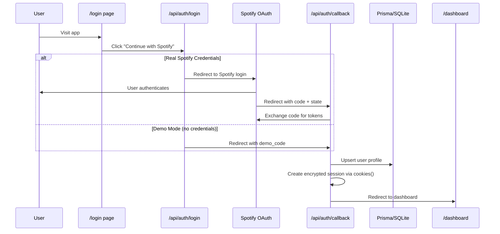

# Spotify Wrapped 2026 — Authentication Phase Complete

## Screenshots

````carousel

<!-- slide -->

````

## Auth Flow



## Files Created/Modified

### New Files
| File | Purpose |
|------|---------|
| [login/page.tsx](file:///home/jonsnow/Desktop/Spotify_Wrapped/app/login/page.tsx) | Animated login page with Spotify branding |
| [auth/login/route.ts](file:///home/jonsnow/Desktop/Spotify_Wrapped/app/api/auth/login/route.ts) | OAuth initiation (auto-detects demo mode) |
| [auth/callback/route.ts](file:///home/jonsnow/Desktop/Spotify_Wrapped/app/api/auth/callback/route.ts) | Token exchange, session creation |
| [auth/logout/route.ts](file:///home/jonsnow/Desktop/Spotify_Wrapped/app/api/auth/logout/route.ts) | Session destruction (POST + GET) |
| [auth/refresh/route.ts](file:///home/jonsnow/Desktop/Spotify_Wrapped/app/api/auth/refresh/route.ts) | Token refresh with rotation support |
| [auth/me/route.ts](file:///home/jonsnow/Desktop/Spotify_Wrapped/app/api/auth/me/route.ts) | Session info for client display |
| [ToastProvider.tsx](file:///home/jonsnow/Desktop/Spotify_Wrapped/components/providers/ToastProvider.tsx) | Toast notification system |
| [lib/env.ts](file:///home/jonsnow/Desktop/Spotify_Wrapped/lib/env.ts) | Environment validation + demo detection |

### Modified Files
| File | Changes |
|------|---------|
| [schema.prisma](file:///home/jonsnow/Desktop/Spotify_Wrapped/prisma/schema.prisma) | Added `avatarUrl`, `refreshToken`, `lastSyncAt` |
| [session.ts](file:///home/jonsnow/Desktop/Spotify_Wrapped/lib/session.ts) | Added `displayName`, `avatarUrl`, `isDemo` |
| [middleware.ts](file:///home/jonsnow/Desktop/Spotify_Wrapped/middleware.ts) | Refactored with path arrays, `/login` route |
| [layout.tsx](file:///home/jonsnow/Desktop/Spotify_Wrapped/app/layout.tsx) | Added `ToastProvider` |
| [page.tsx](file:///home/jonsnow/Desktop/Spotify_Wrapped/app/page.tsx) | Root redirects to `/login` |
| [dashboard/page.tsx](file:///home/jonsnow/Desktop/Spotify_Wrapped/app/(dashboard)/dashboard/page.tsx) | User profile, logout, toast integration |
| [insights/route.ts](file:///home/jonsnow/Desktop/Spotify_Wrapped/app/api/insights/route.ts) | Auto-refresh, `isDemo` flag support |
| [useInsights.ts](file:///home/jonsnow/Desktop/Spotify_Wrapped/hooks/useInsights.ts) | 401 → auto-refresh → retry logic |

### Removed Files
- `app/api/callback/route.ts` → replaced by `app/api/auth/callback/route.ts`
- `app/api/refresh/route.ts` → replaced by `app/api/auth/refresh/route.ts`
- `app/api/session/route.ts` → replaced by `app/api/auth/me/route.ts`

## Security Features

| Feature | Implementation |
|---------|---------------|
| HTTP-only cookies | `cookieOptions.httpOnly: true` |
| Encrypted session | iron-session AES-256 encryption |
| CSRF state validation | `crypto.randomUUID()` stored in cookie |
| Secure cookie | `secure: true` in production |
| SameSite | `lax` — prevents CSRF on cross-site requests |
| Token refresh | Auto-refresh in insights route + dedicated endpoint |
| Token rotation | Handles Spotify's rotating refresh tokens |
| No client secrets exposed | All token operations server-side only |

## Folder Structure

```
app/
├── page.tsx                          # Root redirect to /login
├── login/page.tsx                    # Polished login UI
├── layout.tsx                        # Root layout + ToastProvider
├── (dashboard)/
│   ├── dashboard/page.tsx            # Main dashboard + user profile
│   ├── story/page.tsx                # Animated Wrapped story
│   └── compare/[userA]/[userB]/      # Friend comparison
├── api/
│   ├── auth/
│   │   ├── route.ts                  # Legacy redirect → /login
│   │   ├── login/route.ts            # OAuth initiation
│   │   ├── callback/route.ts         # Token exchange + session
│   │   ├── logout/route.ts           # Session destruction
│   │   ├── refresh/route.ts          # Token refresh
│   │   └── me/route.ts              # Session info
│   ├── insights/route.ts             # Spotify data + auto-refresh
│   └── share/route.ts                # Share card generation
```

## Spotify Developer Dashboard Setup

1. Go to [developer.spotify.com/dashboard](https://developer.spotify.com/dashboard)
2. Click **Create App**
3. Fill in:
   - **App Name**: Spotify Wrapped 2026
   - **Redirect URI**: `http://localhost:3000/api/auth/callback`
   - **APIs used**: Web API
4. Copy **Client ID** and **Client Secret**
5. Paste into `.env.local`:
   ```env
   SPOTIFY_CLIENT_ID=<your_client_id>
   SPOTIFY_CLIENT_SECRET=<your_client_secret>
   ```
6. Restart dev server — real Spotify login is now active

## Local Development

```bash
# Install dependencies
npm install

# Set up environment
cp .env.example .env.local
# Edit .env.local with your credentials (or leave defaults for Demo Mode)

# Initialize database
npx prisma db push

# Start dev server
npm run dev
```

> [!TIP]
> Without Spotify credentials, the app runs in **Demo Mode** automatically — no configuration needed for initial testing.

## Vercel Deployment

1. Push to GitHub
2. Import in Vercel
3. Set environment variables:
   - `SPOTIFY_CLIENT_ID` / `SPOTIFY_CLIENT_SECRET`
   - `SESSION_SECRET` (generate with `openssl rand -base64 32`)
   - `SPOTIFY_REDIRECT_URI` = `https://your-domain.vercel.app/api/auth/callback`
   - `NEXT_PUBLIC_SITE_URL` = `https://your-domain.vercel.app`
   - `DATABASE_URL` = PostgreSQL connection string (Neon/Supabase)
   - `KV_REST_API_URL` / `KV_REST_API_TOKEN` (Upstash Redis)
4. Update Spotify Developer Dashboard redirect URI to production URL
5. Change `schema.prisma` provider from `sqlite` to `postgresql`

> [!WARNING]
> SQLite does **not** persist across Vercel serverless invocations. You must use PostgreSQL (Neon/Supabase) in production.
